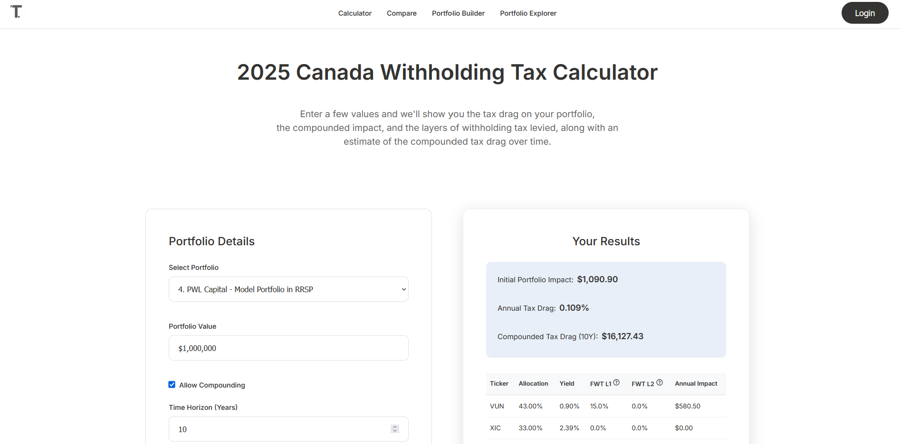
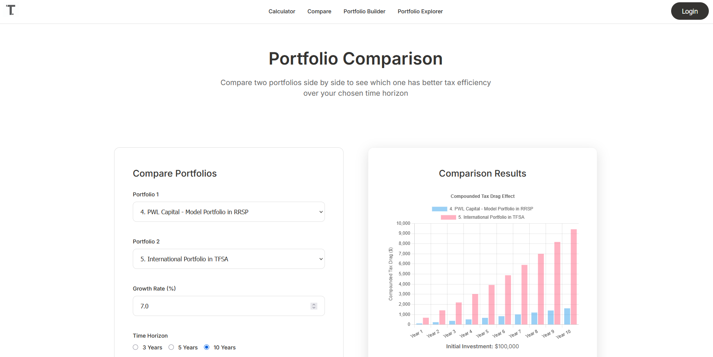

## TaxDrag.ca – Foreign Withholding Tax Calculator  

TaxDrag.ca is a full-stack web application designed to simplify how Canadian investors understand the impact of **foreign withholding taxes (FWTs)** on their portfolios.  
It allows users to build, explore, and compare ETF portfolios across different account types (RRSP, TFSA, Non-Registered) and visualize tax Inefficienies. 

  
---

## Features
- Create custom portfolios (with or without signing in).  
- Explore **pre-built portfolios**, including PWL Capital’s model portfolios.  
- Analyze **foreign withholding tax drag** by account type, fund structure, and exchange.  
- Visualize results with interactive charts (Chart.js).  
- Anonymous portfolio creation supported with **UUID tracking** for non-signed-in users.  

  
---

## Tech Stack
Backend: PHP, MySQL, Model-View-Controller Desgin Architecture  
Frontend: HTML5, CSS3, JavaScript, jQuery, Chart.js  

  

---

## Project Structure
/controllers -> PHP controllers (business logic)

/models -> Database interactions

/views -> HTML/PHP templates

/styles -> CSS

database/ -> calculator_schema.sql (database setup)
